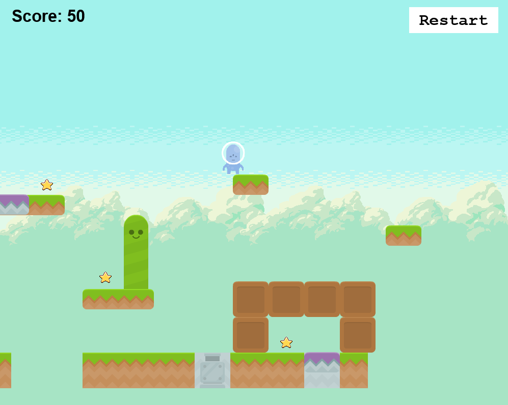

# Simple Phaser Parkour Game

A modern parkour platformer built with [Phaser 3](https://phaser.io/), [Next.js](https://nextjs.org/), and [React](https://react.dev/). Run, jump, teleport, and collect stars as you navigate a challenging level filled with hazards and surprises.



---

## Features

- Fast-paced arcade platformer gameplay
- Teleporters, gravity guns, moving enemies, and collectibles
- Built with TypeScript, React, and Phaser 3
- Hot-reloading for rapid development
- Production-ready build scripts

---

## Getting Started

### Prerequisites

- [Node.js](https://nodejs.org/) (v16 or newer recommended)

### Installation

```bash
npm install
```

### Development

```bash
npm run dev
```

Open [http://localhost:8080](http://localhost:8080) in your browser.

### Production Build

```bash
npm run build
```

The output will be in the `dist/` folder.

---

## Gameplay Controls

- **Move:** Arrow keys (left/right)
- **Jump:** Up arrow
- **Teleport:** Stand on a teleporter and press Down
- **Collect stars** for points
- **Avoid hazards:** Cacti, snails, bombs, and more
- **Reach the UFO** to win the game
- **Restart:** Click the "Restart" button in the game

---

## Project Structure

```
src/
  game/
    main.ts         # Phaser game config and entry point
    scenes/         # Game scenes (MainMenu, Game, GameOver, etc.)
  PhaserGame.tsx    # React component bridging Phaser and React
public/assets/      # Game images and sprites
```

---

## Scripts

| Command               | Description                                 |
| --------------------- | ------------------------------------------- |
| `npm install`         | Install dependencies                        |
| `npm run dev`         | Start development server (with logging)     |
| `npm run build`       | Build for production (with logging)         |
| `npm run dev-nolog`   | Start dev server (no anonymous logging)     |
| `npm run build-nolog` | Build for production (no anonymous logging) |

---

## License

MIT

---

Enjoy playing and customizing your parkour platformer!

